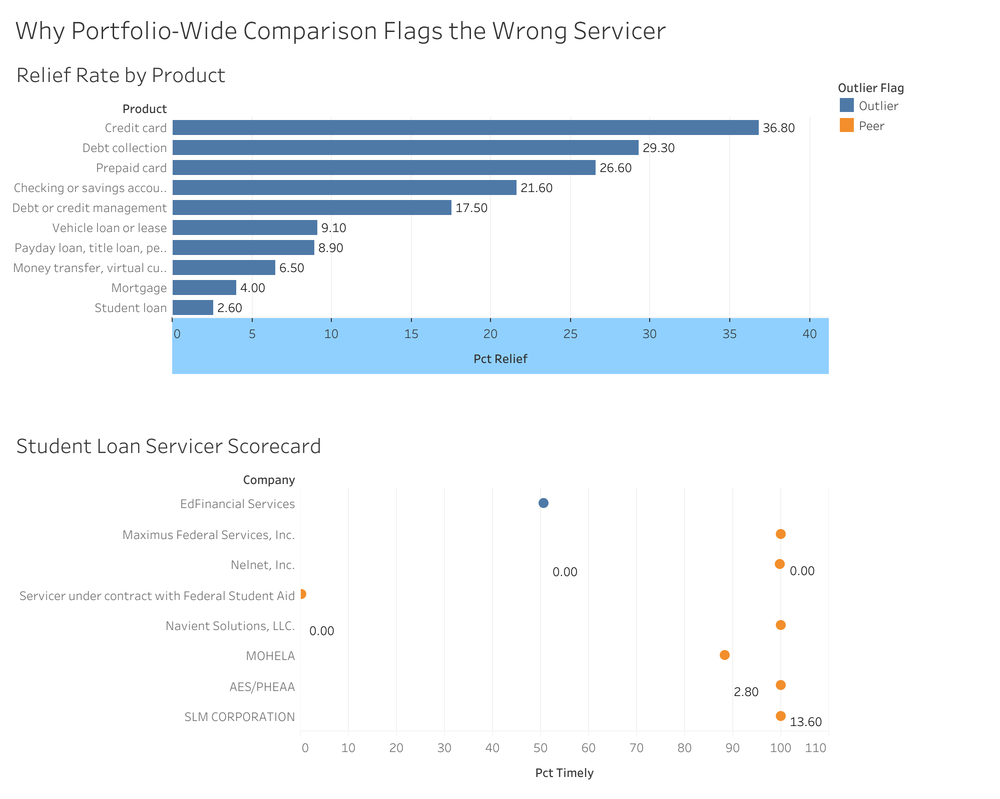

# Dashboard

- Tableau Public link: https://public.tableau.com/app/profile/sez.ozrn/viz/CFPBCAServicerBenchmarking/Dashboard1
- One screen. One decision question. No scrolling, no tab sprawl.
- Two sheets: relief rate by product (context), student loan servicer scorecard (the finding)
- The scorecard is a single dot plot — Company on Rows, Pct Timely on Columns (fixed
  0–110 axis), one Circle mark per company, colored by Outlier Flag, labeled with
  Pct Relief. N is in the tooltip. An earlier build put `SUM(Pct Relief)` on Rows
  alongside Company, which created a separate mini-axis nested inside every row
  (visually broken, not a deliberate trellis) — removed.
- Data in: `sql/30_dashboard_extracts.sql` → `relief_by_product.csv`, `student_loan_scorecard.csv`
- Screenshot: `screenshots/01_dashboard_full.png`

