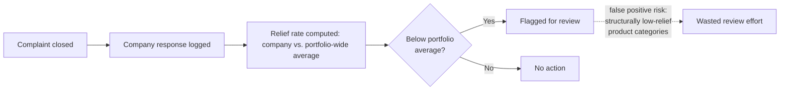
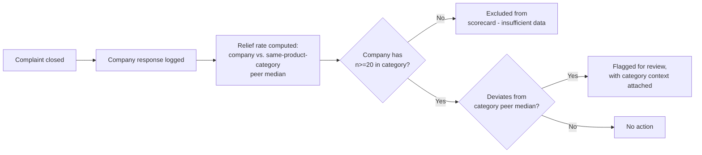

# Business Requirements Document
## Within-Product-Category Servicer Complaint Scorecard

| | |
|---|---|
| **Version** | 0.1 (draft) |
| **Author** | Sezgi Ozturan |
| **Status** | Draft |
| **Related** | [Decision Memo](01_decision_memo.md), [KPI Dictionary](03_kpi_dictionary.md) |

---

## 1. Background & business need

The current practice of comparing a company's complaint-resolution relief rate
against a single portfolio-wide average produces false positives: relief rate varies
14x by product category alone (F1, decision memo), so companies in structurally
low-relief categories (student loans, mortgages) get flagged regardless of actual
complaint-handling quality, while real outliers within a category (F3: EdFinancial
Services' 50.7% timely rate, roughly half of its peers) go undetected by a
portfolio-wide view.

## 2. Objectives & success metrics

| ID | Objective | Metric (→ KPI Dictionary) | Target |
|---|---|---|---|
| O1 | Replace portfolio-wide relief-rate comparison with within-category comparison | KPI-04 (Within-Category Servicer Deviation) | 100% of flagged companies have a same-category peer group of n>=2 companies with n>=20 complaints each |
| O2 | Reduce false-positive review flags on structurally low-relief product categories | KPI-02 review volume, pre/post | Student loan category review flags drop to companies deviating from the 2.6% category baseline, not the 23%+ portfolio baseline |
| O3 | Surface genuine within-category outliers currently missed | KPI-01 (Timely Response Rate), stratified by product | Pilot correctly flags EdFinancial Services (50.7% timely vs. 88-100% range among reliably-sized peers, excluding the thin-sample FSA contractor entry — see decision memo Evidence #3). This is deliberately a known-answer validation case: the outlier was identified in the evidence base, so reproducing it is the pilot's minimum bar, not its success proof — the real O3 test is whether the pilot surfaces outliers *beyond* this one over the quarter |

## 3. Scope

**In scope:** Student loan product category scorecard (8 servicers with n>=20),
piloted for one quarter, using existing CA CFPB complaint data as the initial
evidence base.

**Out of scope:** The other 9 product categories (phase 2, pending pilot results).
Statistical regression-based outlier detection (considered and deferred — see
decision memo options table). National (non-CA) data.

## 4. Stakeholders

| Role | Interest | Involvement |
|---|---|---|
| VP, Consumer Response Operations | Owns the decision to change the review methodology | R (approves) |
| Compliance/ops analyst | Runs the scorecard, flags companies for review | R (executes) |
| Servicer relationship managers | Receive flags, may dispute methodology | C |
| Legal/regulatory affairs | Confirms flagging methodology doesn't create unsubstantiated claims against a servicer | C |

## 5. Current-state process

## 6. Future-state process

## 7. Business requirements

| ID | Requirement | Priority (MoSCoW) | Traces to |
|---|---|---|---|
| BR-01 | The scorecard shall compute relief rate and timely-response rate per company, grouped by product category, not pooled across categories | Must | F1 |
| BR-02 | The scorecard shall exclude companies with fewer than 20 complaints in a given product-category-quarter from outlier flagging (insufficient sample) | Must | KPI-01 limitations |
| BR-03 | The scorecard shall display each flagged company alongside its category peer group and the peer median, not just a single company-level number | Must | F1, F3 |
| BR-04 | The scorecard shall flag companies whose rate deviates from the category peer median beyond a threshold to be set during the pilot (starting point: bottom quartile within category) | Should | O3 |
| BR-05 | The scorecard shall retain the ability to view the old portfolio-wide comparison alongside the new one during the pilot quarter, for stakeholder comparison | Should | Pilot transition |
| BR-06 | The scorecard shall exclude the "Credit reporting or other personal consumer reports" product from all comparisons (84.9% of total volume; a separate, higher-volume workflow — see docs/04_data_notes.md) | Must | Data notes #1 |

## 8. Functional requirements

| ID | Requirement | Priority | Traces to |
|---|---|---|---|
| FR-01 | Relief rate calculation shall combine "Closed with monetary relief" and "Closed with non-monetary relief" into a single numerator, per KPI-02's definition | Must | KPI-02 |
| FR-02 | The scorecard shall recompute quarterly as new closed complaints become available | Must | O1 |
| FR-03 | Flagged-company records shall include the underlying complaint count (n), not just the rate, to prevent low-volume noise from being read as a strong signal | Must | KPI-01 limitations |

## 9. Assumptions, constraints, dependencies

- Assumes company and product fields remain consistently populated (verified at
  100% and 100% respectively in `complaints_core` — see docs/04_data_notes.md).
- Assumes CFPB's complaint categories and company-response taxonomy remain stable
  during the pilot quarter (a real risk — see docs/04_data_notes.md taxonomy-drift
  finding from the DQ pass).
- Dependent on continued API/data access to CFPB's complaint database (CA-scoped
  ingestion pipeline already built — see src/ingest.py).

## 10. Acceptance criteria

- O1: Every flagged company in the pilot output has a documented peer group size >= 2.
- O2: Student loan category flags no longer include companies whose only "problem" is
  being in a low-relief-rate product category (i.e., no company is flagged solely for
  falling below a 23%+ portfolio-wide threshold when its category median is <5%).
- O3: EdFinancial Services appears in the pilot's flagged list, with its 50.7% timely
  rate shown against the 88-100% range among reliably-sized peers (known-answer
  validation case — see the O3 note in Section 2; this is the floor, not the finish line).

## 11. Open questions

| # | Question | Owner | Needed by |
|---|---|---|---|
| 1 | What deviation threshold (bottom quartile? >2 std dev from category median?) should trigger a flag, given only 8 servicers in the student loan pilot category? | Compliance/ops analyst | Before pilot launch |
| 2 | Should the Federal Student Aid contractor entry (n=57, 0% relief, 0% timely) be flagged despite thin sample size, given the severity of the combined signal? | VP, Consumer Response Ops | Before pilot launch |
| 3 | Does legal/regulatory affairs require a minimum evidentiary standard before a servicer flag can be shared externally or used in a regulatory conversation? | Legal/regulatory affairs | Before phase 2 (multi-category) rollout |
| 4 | A feasibility check (evals/README.md) found LLM-based complaint classification agrees with official categories only 44% of the time in "Debt or credit management" — hand-inspection suggests this reflects intake miscategorization (complaints that read as debt-collection harassment filed under the wrong category), not model error. Should this motivate a targeted audit of that category's intake accuracy, independent of the servicer-benchmarking pilot? | Compliance/ops analyst | Before phase 2 |
